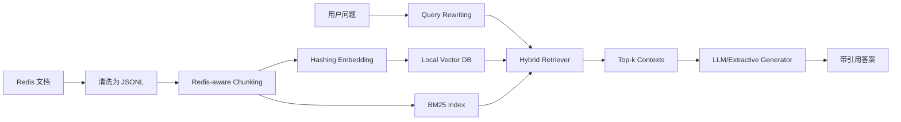

# Redis-RAG 垂直领域深度问答系统

本仓库实现了一个面向 **Redis 官方文档/技术知识** 的 RAG 问答系统，满足课程作业中“私有知识库构建、Chunking、Embedding、向量数据库、LLM 生成、高级 RAG 优化、量化评估、一键推理脚本”的要求。

## 1. 项目特点

- **垂直领域知识库**：以内置 `data/raw/redis_seed_docs.jsonl` 作为 Redis 清洗知识库，并提供 `scripts/collect_redis_docs.py` 从 Redis 官方文档页面抓取和清洗语料。
- **Chunking**：基于 Redis-aware tokenizer 进行重叠分块，默认 `chunk_size=320`、`overlap=40`。
- **Embedding 与向量库**：默认使用可复现的 hashing embedding，将 chunk 向量写入 `data/index/vectors.jsonl`，形成本地 JSONL 向量数据库。
- **高级 RAG 优化**：实现 Query Rewriting + Hybrid Retrieval，即向量相似度和 BM25 关键词检索融合。
- **生成模块**：默认使用严格基于上下文的抽取式生成；如果配置 `DEEPSEEK_API_KEY` 或 `OPENAI_API_KEY`，会自动调用 OpenAI-compatible Chat Completion API。
- **三维量化评估**：从 Context Relevance、Faithfulness、Answer Relevance 三个维度输出 JSON/CSV 评估结果。

## 2. 目录结构

```text
.
├── build_index.py                 # 构建向量索引
├── infer.py                       # 一键推理脚本
├── evaluate.py                    # 三维量化评估脚本
├── requirements.txt               # 环境依赖
├── src/rag_redis/                 # RAG 核心模块
├── data/raw/redis_seed_docs.jsonl # 内置 Redis 清洗知识库
├── data/eval/eval_questions.jsonl # 评估问题集
├── scripts/collect_redis_docs.py  # 官方文档抓取清洗脚本
├── outputs/                       # 评估输出
├── report/                        # 论文式报告
└── slides/                        # 汇报 PPT
```

## 3. 环境安装

推荐 Python 3.9+。

```bash
python3 -m pip install -r requirements.txt
```

核心问答链路只依赖 Python 标准库；`requirements.txt` 主要用于测试、PDF 和 PPT 相关交付物。

## 4. 一键运行推理

无需手动建索引，`infer.py` 会在索引不存在时自动构建。

```bash
python3 infer.py --question "Redis 的 AOF 和 RDB 持久化有什么区别？"
```

输出包含答案、引用来源和索引目录。也可以输出 JSON：

```bash
python3 infer.py --question "Redis Stream 和 Pub/Sub 有什么区别？" --json
```

## 5. 构建知识库与索引

使用内置清洗语料构建索引：

```bash
python3 build_index.py
```

从 Redis 官方文档页面抓取并清洗语料：

```bash
python3 scripts/collect_redis_docs.py --output data/raw/redis_official_docs.jsonl
python3 build_index.py --corpus data/raw/redis_official_docs.jsonl --index-dir data/index_official
```

## 6. 可选 LLM 接入

默认情况下，系统使用抽取式生成器，保证没有 API key 时也能复现。若需要接入 DeepSeek 或其他 OpenAI-compatible LLM：

```bash
export DEEPSEEK_API_KEY="你的 DeepSeek API Key"
# 可选：DeepSeek 官方 OpenAI-compatible base URL 默认为 https://api.deepseek.com
export OPENAI_MODEL="deepseek-v4-pro"

python3 infer.py --question "Redis Sentinel 主要解决什么问题？"
```

生成模块的系统提示会要求模型只基于检索上下文回答，并用 `[1]`、`[2]` 形式引用来源。

注意：不要把 API key 写入代码、README 或 git 提交记录。

## 7. 量化评估

运行：

```bash
python3 evaluate.py --rebuild
```

当前内置评估集结果：

| 指标 | 分数 |
|---|---:|
| Context Relevance | 1.0000 |
| Faithfulness | 0.8116 |
| Answer Relevance | 0.8750 |

输出文件：

- `outputs/eval_results.json`
- `outputs/eval_results.csv`

## 8. 方法概述



混合检索的融合分数：

```text
score = 0.45 * normalized_vector_score + 0.55 * normalized_bm25_score
```

Redis 问答中大量问题包含精确命令名和缩写，例如 `AOF`、`RDB`、`SET`、`TTL`、`XREADGROUP`。因此 BM25 可以弥补纯向量检索对精确术语不敏感的问题。

## 9. 测试

```bash
PYTHONPATH=src python3 -m pytest tests -q
```

测试覆盖：

- 文本归一化和 Redis 领域分词
- Chunking 元数据和 overlap
- Hybrid Retrieval 排序
- 答案生成引用
- 三维评估指标

## 10. 已知局限

- 默认 hashing embedding 更适合课程复现，不等价于大规模语义模型；真实部署建议替换为 `BAAI/bge-small-zh-v1.5` 或其他 SentenceTransformer 模型。
- 内置评估集规模较小，主要用于演示三维指标计算流程；正式系统应扩展到更多真实用户问题。
- 抽取式生成能降低幻觉，但答案表达不如强 LLM 自然；接入 LLM 后需要继续监控 Faithfulness。
