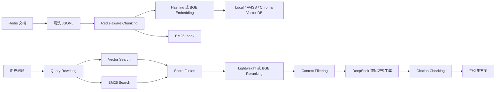

# Redis-RAG 垂直领域深度问答系统

本项目是“基于 RAG 的垂直领域深度问答系统构建”课程作业的完整代码仓库。系统面向 **Redis 官方文档与技术知识**，实现私有知识库构建、文档清洗、Chunking、Embedding、向量数据库、Query Rewriting、混合检索、二阶段重排序、DeepSeek/OpenAI-compatible 生成、自动 citation checking、三维量化评估和检索策略消融对比。

项目的设计目标不是简单套用一个现成 RAG 框架，而是把 RAG 的关键模块拆开实现并保留真实运行输出，方便在答辩时解释每个模块的作用、指标如何计算，以及系统为什么能降低幻觉。

## 1. 作业要求对应关系

| 作业要求 | 本项目实现 |
|---|---|
| 构建私有知识库 | 使用 Redis 官方文档主题，内置清洗语料 `data/raw/redis_seed_docs.jsonl`，并提供官方文档采集脚本 |
| 文档 Chunking | `src/rag_redis/chunking.py` 实现基于 Redis-aware tokenizer 的重叠分块 |
| Embedding 模型 | 默认 deterministic hashing embedding；可选 `BAAI/bge-small-zh-v1.5`、`BAAI/bge-base-zh-v1.5` 或任意 SentenceTransformer 模型 |
| 向量数据库 | 默认 JSONL 本地向量库；可选 FAISS 或 Chroma 后端 |
| LLM 生成 | 支持 DeepSeek/OpenAI-compatible API，默认模型名为 `deepseek-v4-pro`；无 key 时使用抽取式生成器保证可复现 |
| 高级 RAG 策略 | Query Rewriting + BM25/Vector Hybrid Retrieval + Lightweight Reranking + 可选 BGE/Cross-Encoder Reranking |
| 幻觉控制 | 生成阶段上下文过滤 + 答案引用来源 + 自动 citation checking |
| 量化评估 | Context Relevance、Faithfulness、Answer Relevance，并记录 `citation_passed` |
| 消融对比 | `compare_retrieval.py` 对比 pure vector、BM25、hybrid、hybrid+rerank |
| 一键推理脚本 | `python3 infer.py --question "..."` |
| 汇报材料 | 可编辑 Word 报告、PPT、逐页演讲者备注、真实运行结果图片 |

## 2. 为什么选择 Redis

Redis 很适合做垂直领域 RAG 作业，原因有三点。

第一，Redis 文档边界清晰，知识库可以围绕数据结构、命令、持久化、高可用、集群、事务、Lua 脚本、缓存风险等主题构建，任务定义明确。

第二，Redis 问答包含大量精确术语和命令名，例如 `AOF`、`RDB`、`TTL`、`EXPIRE`、`XREADGROUP`、`MULTI`、`EXEC`。如果检索系统漏掉这些词，答案就会偏离问题。因此 Redis 能很好地展示“语义检索”和“关键词检索”的差异。

第三，Redis 文档可追溯。知识库记录保留 `url`，答案也输出 `[1]`、`[2]` 形式引用，适合展示 RAG 如何减少幻觉并提升可解释性。

## 3. 项目结构

```text
.
├── README.md                         # 项目说明与复现实验步骤
├── requirements.txt                  # 环境依赖与可选高级依赖
├── build_index.py                    # 构建 chunk 和向量索引
├── infer.py                          # 一键推理脚本
├── evaluate.py                       # 三维量化评估脚本
├── compare_retrieval.py              # 检索策略消融对比脚本
├── src/rag_redis/
│   ├── text.py                       # 文本归一化和 Redis-aware tokenizer
│   ├── corpus.py                     # JSONL 文档读写
│   ├── chunking.py                   # 文档分块
│   ├── embeddings.py                 # hashing / BGE / SentenceTransformer embedding
│   ├── vector_store.py               # local / FAISS / Chroma 向量库
│   ├── query.py                      # Query Rewriting
│   ├── retriever.py                  # BM25 + Vector 混合检索与 reranking
│   ├── generator.py                  # DeepSeek/OpenAI-compatible 生成与抽取式回退
│   ├── citations.py                  # 生成后 citation checking
│   ├── evaluation.py                 # 三维评估指标
│   └── pipeline.py                   # RAG pipeline 组装
├── data/
│   ├── raw/redis_seed_docs.jsonl     # 内置 Redis 清洗知识库
│   ├── eval/eval_questions.jsonl     # 20 条评估问题集
│   └── index/                        # 构建后的 chunk 和向量索引
├── scripts/
│   ├── collect_redis_docs.py         # 从 Redis 官方文档页面收集语料
│   ├── create_visual_assets.py       # 生成架构图和真实运行结果图片
│   ├── create_report_docx.py         # 可编辑 Word 报告生成脚本
│   └── create_pptx.js                # PPT 和演讲者备注生成脚本
├── outputs/
│   ├── eval_results.json/csv         # 三维评估结果
│   ├── retrieval_comparison.json/csv # 检索消融结果
│   └── run_logs/                     # 真实命令输出日志
├── report/
│   ├── redis_rag_report.md           # 论文式报告 Markdown
│   └── redis_rag_report.docx         # 可编辑 Word 报告
└── slides/
    ├── redis_rag_presentation.pptx   # 汇报 PPT，备注区包含完整演讲稿
    ├── redis_rag_speaker_script.md   # 逐页讲稿备份
    └── assets/                       # 架构图、运行结果图、评估图
```

## 4. 环境安装

推荐 Python 3.9+。

```bash
python3 -m pip install -r requirements.txt
```

默认链路只依赖轻量 Python 包，适合作业验收时快速复现。BGE embedding、FAISS、Chroma、BGE reranker 属于可选增强依赖，在 `requirements.txt` 中以注释形式给出，避免普通机器第一次运行时被大模型下载或编译依赖卡住。

如果要启用高级链路，可以手动安装：

```bash
python3 -m pip install sentence-transformers faiss-cpu chromadb
```

## 5. 快速开始

### 5.1 一键推理

无需手动建索引。`infer.py` 会在 `data/index/` 不存在时自动构建索引。

```bash
python3 infer.py --question "Redis 的 AOF 和 RDB 持久化有什么区别？"
```

JSON 输出：

```bash
python3 infer.py --question "Redis Stream 和 Pub/Sub 有什么区别？" --json
```

输出内容包括用户问题、答案、引用来源、检索片段、`combined_score`、`vector_score`、`bm25_score`、`rerank_score`、`term_coverage` 和 `citation_check`。

### 5.2 使用 DeepSeek

系统默认识别 DeepSeek API，模型名默认为 `deepseek-v4-pro`。

```bash
export DEEPSEEK_API_KEY="你的 DeepSeek API Key"
export OPENAI_MODEL="deepseek-v4-pro"
python3 infer.py --question "Redis Sentinel 主要解决什么问题？"
```

安全提醒：不要把 API key 写入代码、README、报告、PPT 或 git 提交记录。

### 5.3 构建索引

```bash
python3 build_index.py
```

默认参数：

```text
chunk_size = 320
overlap = 40
embedding_dimensions = 256
embedding_model = hashing
vector_store = local
```

构建完成后会生成：

```text
data/index/chunks.jsonl
data/index/vectors.jsonl
```

### 5.4 启用 BGE + FAISS 或 Chroma

安装可选依赖后，可以使用神经 embedding 和向量库后端。更换 embedding 时建议加 `--rebuild`，因为向量维度会变化。

```bash
python3 build_index.py --embedding-model bge --vector-store faiss
python3 infer.py --question "Redis 如何设置互斥锁？" --embedding-model bge --vector-store faiss --rebuild
```

也可以使用 Chroma：

```bash
python3 build_index.py --embedding-model bge --vector-store chroma
```

### 5.5 运行评估

```bash
python3 evaluate.py --rebuild
```

当前 20 条评估集结果：

| 指标 | 分数 | 含义 |
|---|---:|---|
| Context Relevance | 0.9750 | 检索结果基本覆盖标注相关文档 |
| Faithfulness | 0.8319 | 答案中大部分内容能被上下文支持 |
| Answer Relevance | 0.9375 | 答案覆盖了多数期望关键词 |

评估结果保存到：

```text
outputs/eval_results.json
outputs/eval_results.csv
```

### 5.6 检索策略消融对比

```bash
python3 compare_retrieval.py --rebuild
```

当前结果：

| 策略 | Context Relevance | Top1 Hit | MRR |
|---|---:|---:|---:|
| pure_vector | 0.8750 | 0.8000 | 0.8267 |
| BM25 | 1.0000 | 1.0000 | 1.0000 |
| hybrid | 0.9750 | 1.0000 | 1.0000 |
| hybrid + rerank | 0.9750 | 1.0000 | 1.0000 |

这个结果说明：在 Redis 这种命令名密集的技术文档任务中，BM25 对精确术语非常强；hybrid 方案虽然平均 Context Relevance 略低于 BM25，但更适合作为通用系统默认策略，因为它同时保留语义相似度和关键词命中能力。`hybrid + rerank` 的价值主要体现在可解释排序和减少弱相关上下文进入生成阶段。

结果保存到：

```text
outputs/retrieval_comparison.json
outputs/retrieval_comparison.csv
```

## 6. 私有知识库构建

项目提供两种知识库来源。

### 6.1 内置清洗语料

`data/raw/redis_seed_docs.jsonl` 是课程可复现版本，覆盖 Redis 概览、String、Hash、List、Stream、Sorted Set、Key 过期、内存淘汰、RDB/AOF、Replication、Sentinel、Cluster、事务、Lua、Pub/Sub、缓存穿透/击穿/雪崩等主题。

每条文档格式如下：

```json
{
  "doc_id": "redis:persistence",
  "title": "Redis persistence with RDB and AOF",
  "url": "https://redis.io/docs/latest/operate/oss_and_stack/management/persistence/",
  "text": "Redis 提供 RDB 和 AOF 两类持久化机制..."
}
```

### 6.2 官方文档采集脚本

如果需要重新收集 Redis 官方文档，可以运行：

```bash
python3 scripts/collect_redis_docs.py --output data/raw/redis_official_docs.jsonl
python3 build_index.py --corpus data/raw/redis_official_docs.jsonl --index-dir data/index_official
```

采集脚本会访问 Redis 文档页面，去除导航、脚本和样式内容，并把正文整理为 JSONL。

## 7. RAG 方法设计

### 7.1 Chunking

系统使用 `src/rag_redis/text.py` 中的 Redis-aware tokenizer。它保留英文命令、缩写、数字和 Redis 领域中文短语，例如：

```text
AOF, RDB, TTL, EXPIRE, XREADGROUP, MULTI, EXEC, 持久化, 主从复制, 消费者组
```

这样做的原因是技术问答中命令名往往比普通自然语言更关键。如果 tokenizer 把命令名切坏或丢掉，后续检索会明显变差。

### 7.2 Embedding 与向量库

默认 embedding 是 deterministic hashing embedding，优势是不需要 GPU、不下载模型、结果可复现。局限是语义能力弱于 BGE、E5 等神经 embedding。

为了满足更高难度要求，项目已经提供可选增强路径：

| 组件 | 默认实现 | 可选增强 |
|---|---|---|
| Embedding | HashingEmbeddingModel | BGE / SentenceTransformer |
| 向量库 | JSONL LocalVectorStore | FAISS / Chroma |
| Reranker | Lightweight term/title coverage | BGE reranker / CrossEncoder |

命令示例：

```bash
python3 infer.py \
  --question "Redis Cluster 为什么跨 slot 多 key 命令会受限制？" \
  --embedding-model bge \
  --vector-store faiss \
  --retrieval-mode hybrid \
  --reranker bge-reranker \
  --rebuild
```

### 7.3 Query Rewriting

Redis 官方文档多为英文，而用户可能用中文提问。系统在 `src/rag_redis/query.py` 中维护领域词扩展表，把中文问题扩展为中英混合检索词。

| 用户词 | 扩展词 |
|---|---|
| 持久化 | persistence, RDB, AOF, snapshot, append only file |
| 高可用 | replication, sentinel, failover, cluster |
| 过期 | expire, TTL, timeout, key expiration |
| 队列 | list, stream, consumer group |
| 互斥锁 | mutex, lock, SET, NX, EX, PX |
| 字段过期 | hash field expiration, TTL |

### 7.4 混合检索

系统同时计算向量相似度和 BM25 分数，并进行归一化融合：

```text
score = 0.45 * normalized_vector_score + 0.55 * normalized_bm25_score
```

BM25 权重略高，是因为 Redis 问答中精确术语非常重要。例如用户问 “AOF 和 RDB 的区别”，如果系统没有命中 `AOF` 和 `RDB`，即使语义相似也很难回答准确。

### 7.5 二阶段重排序

默认 reranker 是轻量可解释版本：

```text
rerank_score = combined_score + 0.20 * term_coverage + 0.08 * title_coverage
```

如果安装了 `sentence-transformers`，可以切换为 BGE reranker 或 cross-encoder：

```bash
python3 infer.py --question "Redis Stream 的消费者组有什么作用？" --reranker bge-reranker
```

轻量 reranker 便于课堂解释，BGE/CrossEncoder reranker 更接近真实生产 RAG 的前沿实践。

### 7.6 生成与 citation checking

生成模块支持两种方式：

1. DeepSeek/OpenAI-compatible LLM：设置 API key 后调用 `deepseek-v4-pro`。
2. 抽取式生成器：无 API key 时，从检索上下文中抽取相关句子生成答案。

两种方式都会要求答案带 `[1]`、`[2]` 形式引用。生成后，`src/rag_redis/citations.py` 会检查三件事：

- 是否存在引用标记。
- 引用编号是否在检索上下文范围内。
- 被引用上下文是否与答案有 token overlap。

`infer.py --json` 和 `evaluate.py` 会输出 `citation_check` / `citation_passed`，用于发现“答案写了引用但引用不存在”或“答案内容和引用上下文不匹配”的情况。

## 8. 系统流程图



## 9. 评估方法

评估集位于 `data/eval/eval_questions.jsonl`，共 20 条 Redis 技术问题，覆盖持久化、过期机制、数据结构、Stream、事务、Lua、集群、复制、内存淘汰、互斥锁和缓存风险等场景。每条样本包含：

```json
{
  "question": "Redis 的 AOF 和 RDB 持久化有什么区别？",
  "gold_doc_ids": ["redis:persistence"],
  "expected_keywords": ["AOF", "RDB", "快照", "写命令"]
}
```

三个指标定义如下：

| 指标 | 计算方式 | 评价对象 |
|---|---|---|
| Context Relevance | `|retrieved_doc_ids ∩ gold_doc_ids| / |gold_doc_ids|` | 检索是否召回相关文档 |
| Faithfulness | `supported_answer_tokens / answer_tokens` | 答案是否被上下文支持 |
| Answer Relevance | `covered_expected_keywords / expected_keywords` | 答案是否回答到关键点 |

这些指标是轻量自动评估，适合作业复现。更严格版本可以继续加入人工评分或 LLM-as-a-judge。

## 10. 示例结果

问题：

```text
Redis 的 AOF 和 RDB 持久化有什么区别？
```

系统检索到的最高相关来源：

```text
redis:persistence
Redis persistence with RDB and AOF
score=1.0819
combined_score=1.0000
rerank_score=1.0819
term_coverage=0.3333
```

生成答案会说明：

- RDB 是某一时刻的数据快照，文件紧凑，适合备份和快速恢复。
- AOF 是追加日志，记录写命令，通常能提供更好的数据安全性。
- 生产中可以同时开启 RDB 和 AOF。
- 答案带有 `[1]` 来源引用，并通过 citation checking。

## 11. Bad Case 与改进分析

早期版本中，AOF/RDB 问题有时会检索到 Pub/Sub 文档，因为 Pub/Sub 文档也出现了“不会持久化”这类词。这个问题说明：RAG 系统不仅要追求 Top-k 召回，还要控制进入生成器的上下文质量。

本项目的处理方式：

- 使用 BM25 强化精确术语匹配。
- 使用 Query Rewriting 提升中英文领域词召回。
- 使用 reranker 提升标题和术语覆盖更好的片段。
- 生成阶段过滤掉与最高分差距过大的弱相关上下文。
- 输出来源和 citation checking，便于人工检查答案依据。

局限也需要承认：默认 hashing embedding 的语义泛化能力有限，轻量自动 Faithfulness 不能完全替代人工事实核查，20 条评估集还不足以覆盖真实用户的全部问法。项目已经提供 BGE/FAISS/CrossEncoder 等增强入口，用于进一步提升生产级能力。

## 12. 测试

```bash
PYTHONPATH=src python3 -m pytest tests -q
```

测试覆盖：

- 文本归一化和 Redis 领域分词。
- Chunking 元数据和 overlap。
- Hybrid Retrieval 排序。
- embedding/vector-store 参数校验。
- DeepSeek 环境变量默认模型。
- 答案生成引用和 citation checking。
- 三维评估指标。

## 13. 交付材料

- `README.md`：项目说明与运行方法。
- `requirements.txt`：环境依赖。
- `infer.py`：一键推理脚本。
- `build_index.py`：索引构建脚本。
- `evaluate.py`：量化评估脚本。
- `compare_retrieval.py`：检索策略消融脚本。
- `report/redis_rag_report.md`：论文式报告 Markdown。
- `report/redis_rag_report.docx`：可编辑 Word 报告。
- `slides/redis_rag_presentation.pptx`：汇报 PPT，讲稿写入备注区。
- `slides/redis_rag_speaker_script.md`：可直接朗读的完整讲稿备份。
- `slides/assets/`：架构图、知识库图、真实运行结果截图、消融对比图。
- `outputs/run_logs/`：生成展示图片时保存的真实命令输出。

## 14. 重新生成报告、图片和 PPT

如果修改了报告、评估结果或 PPT 内容，可以按下面顺序重新生成展示材料：

```bash
# 1. 重新生成评估结果
python3 evaluate.py --rebuild

# 2. 运行检索策略消融
python3 compare_retrieval.py --rebuild

# 3. 生成 PPT 中使用的介绍图和真实运行结果图
python3 scripts/create_visual_assets.py

# 4. 生成可编辑 Word 报告
python3 scripts/create_report_docx.py

# 5. 生成 PPT 和逐页讲稿
npm install
npm run slides
```

普通提交作业时不需要重新生成，仓库中已经包含生成好的 DOCX、PPT、讲稿和图片资产。

PPT 的演讲稿已经写入 PowerPoint 备注区。汇报时请使用 PowerPoint 的“演讲者视图”，投影画面只显示幻灯片，备注内容只显示在你自己的电脑屏幕上。

## 15. 已完成的增强点

用户最初提出的后续增强已经落实到当前版本：

- 已支持 BGE/SentenceTransformer embedding。
- 已支持 FAISS 和 Chroma 向量库入口。
- 已支持 BGE reranker / cross-encoder reranker。
- 已把评估集扩展到 20 条真实技术问题。
- 已实现 pure vector、BM25、hybrid、hybrid+rerank 的消融对比。
- 已在 DeepSeek/抽取式生成后加入 citation checking。

后续如果继续加深，可以把知识库扩大到完整 Redis 官方站点，加入人工评分表，并把 citation checking 从 token overlap 升级为 LLM judge 或 NLI 模型。
