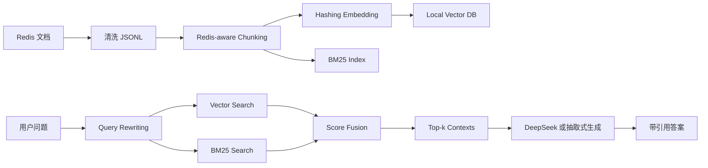

# Redis-RAG 垂直领域深度问答系统

本项目是“基于 RAG 的垂直领域深度问答系统构建”课程作业的完整代码仓库。系统面向 **Redis 官方文档与技术知识**，实现从私有知识库构建、文档清洗、Chunking、Embedding、向量数据库、混合检索、LLM 生成到三维量化评估的完整闭环。

项目重点不是简单调用一个现成 RAG 框架，而是把 RAG 系统中最关键的模块拆开实现，便于解释每一步为什么存在、如何影响检索和生成质量。

## 1. 作业要求对应关系

| 作业要求 | 本项目实现 |
|---|---|
| 构建私有知识库 | 使用 Redis 官方文档主题，内置清洗语料 `data/raw/redis_seed_docs.jsonl`，并提供官方文档采集脚本 |
| 文档 Chunking | `src/rag_redis/chunking.py` 实现基于 Redis-aware tokenizer 的重叠分块 |
| Embedding 模型 | 默认使用可复现的 hashing embedding；文档中说明如何替换为 BGE/SentenceTransformer |
| 向量数据库 | `data/index/vectors.jsonl` 保存 chunk 向量和元数据，作为本地向量库 |
| LLM 生成 | 支持 DeepSeek / OpenAI-compatible API；无 key 时使用抽取式生成器保证可复现 |
| 高级 RAG 策略 | Query Rewriting + BM25/Vector Hybrid Retrieval |
| 三维量化评估 | Context Relevance、Faithfulness、Answer Relevance |
| 一键推理脚本 | `python3 infer.py --question "..."` |

## 2. 为什么选择 Redis 作为垂直领域

Redis 是一个很适合做 RAG 作业的技术领域，原因有三点。

第一，Redis 文档具有明显的垂直知识边界。系统可以围绕数据结构、命令、持久化、高可用、集群、事务、Lua 脚本、缓存风险等主题建立知识库，任务定义清楚。

第二，Redis 问答中大量出现精确术语和命令名，例如 `AOF`、`RDB`、`TTL`、`EXPIRE`、`XREADGROUP`、`MULTI`、`EXEC`。这些词如果被检索系统漏掉，答案就会偏离问题。因此 Redis 能很好地展示“纯向量检索”和“关键词检索”之间的差异。

第三，Redis 文档内容可追溯。每条知识库记录都保存 `url`，最终答案也会输出引用来源，适合讨论 RAG 如何降低幻觉。

## 3. 项目结构

```text
.
├── README.md                         # 项目说明与复现实验步骤
├── requirements.txt                  # 环境依赖
├── build_index.py                    # 构建 chunk 和向量索引
├── infer.py                          # 一键推理脚本
├── evaluate.py                       # 三维量化评估脚本
├── src/rag_redis/
│   ├── text.py                       # 文本归一化和 Redis-aware tokenizer
│   ├── corpus.py                     # JSONL 文档读写
│   ├── chunking.py                   # 文档分块
│   ├── embeddings.py                 # hashing embedding
│   ├── vector_store.py               # 本地向量数据库
│   ├── query.py                      # Query Rewriting
│   ├── retriever.py                  # BM25 + Vector 混合检索
│   ├── generator.py                  # DeepSeek/OpenAI-compatible 生成与抽取式回退
│   ├── evaluation.py                 # 三维评估指标
│   └── pipeline.py                   # RAG pipeline 组装
├── data/
│   ├── raw/redis_seed_docs.jsonl     # 内置 Redis 清洗知识库
│   ├── eval/eval_questions.jsonl     # 评估问题集
│   └── index/                        # 构建后的 chunk 和向量索引
├── scripts/
│   ├── collect_redis_docs.py         # 从 Redis 官方文档页面收集语料
│   ├── create_report_pdf.py          # 报告 PDF 生成脚本
│   └── create_pptx.js                # PPT 和讲稿生成脚本
├── outputs/
│   ├── eval_results.json             # 评估结果 JSON
│   └── eval_results.csv              # 评估结果 CSV
├── report/
│   ├── redis_rag_report.md           # 论文式报告 Markdown
│   └── redis_rag_report.pdf          # 论文式报告 PDF
└── slides/
    ├── redis_rag_presentation.pptx   # 汇报 PPT
    └── redis_rag_speaker_script.md   # 逐页讲稿
```

## 4. 环境安装

推荐 Python 3.9+。

```bash
python3 -m pip install -r requirements.txt
```

核心 RAG 链路只使用 Python 标准库即可运行。`requirements.txt` 中的额外依赖主要用于测试、报告 PDF 和 PPT 生成。

## 5. 快速开始

### 5.1 一键推理

无需手动建索引。`infer.py` 会在 `data/index/` 不存在时自动构建索引。

```bash
python3 infer.py --question "Redis 的 AOF 和 RDB 持久化有什么区别？"
```

输出包含：

- 用户问题
- 基于检索上下文生成的答案
- 引用来源
- 每个检索片段的 `combined_score`、`vector_score`、`bm25_score`

JSON 输出：

```bash
python3 infer.py --question "Redis Stream 和 Pub/Sub 有什么区别？" --json
```

### 5.2 构建索引

```bash
python3 build_index.py
```

默认参数：

```text
chunk_size = 320
overlap = 40
embedding_dimensions = 256
```

构建完成后会生成：

```text
data/index/chunks.jsonl
data/index/vectors.jsonl
```

### 5.3 运行评估

```bash
python3 evaluate.py --rebuild
```

当前内置评估集结果：

| 指标 | 分数 | 含义 |
|---|---:|---|
| Context Relevance | 1.0000 | 检索结果覆盖了标注相关文档 |
| Faithfulness | 0.8116 | 答案中大部分内容能被上下文支持 |
| Answer Relevance | 0.8750 | 答案覆盖了多数期望关键词 |

评估结果会保存到：

```text
outputs/eval_results.json
outputs/eval_results.csv
```

## 6. 私有知识库构建

本项目提供两种知识库来源。

### 6.1 内置清洗语料

`data/raw/redis_seed_docs.jsonl` 是课程作业可复现版本，覆盖 16 个 Redis 主题：

- Redis 概览与应用场景
- String、Hash、List、Stream、Sorted Set
- Key 过期与 TTL
- 内存淘汰策略
- RDB 与 AOF 持久化
- Replication、Sentinel、Cluster
- MULTI/EXEC/WATCH 事务
- Lua 脚本
- Pub/Sub
- 缓存穿透、缓存击穿、缓存雪崩

每条文档格式如下：

```json
{
  "doc_id": "redis:persistence",
  "title": "Redis persistence with RDB and AOF",
  "url": "https://redis.io/docs/latest/operate/oss_and_stack/management/persistence/",
  "text": "Redis 提供 RDB 和 AOF 两类持久化机制..."
}
```

### 6.2 官方文档采集脚本

如果需要重新收集 Redis 官方文档，可以运行：

```bash
python3 scripts/collect_redis_docs.py --output data/raw/redis_official_docs.jsonl
python3 build_index.py --corpus data/raw/redis_official_docs.jsonl --index-dir data/index_official
```

采集脚本会访问 Redis 文档页面，去除导航、脚本和样式内容，并把正文整理为 JSONL。

## 7. RAG 方法设计

### 7.1 Chunking

系统使用 `src/rag_redis/text.py` 中的 Redis-aware tokenizer。它会保留英文命令、缩写、数字和 Redis 领域中文短语，例如：

```text
AOF, RDB, TTL, EXPIRE, XREADGROUP, MULTI, EXEC, 持久化, 主从复制, 消费者组
```

这样做的原因是：技术问答中命令名往往比自然语言描述更关键。如果 tokenizer 把命令名丢掉，后续检索会明显变差。

### 7.2 Embedding 与向量库

默认 embedding 是 deterministic hashing embedding。它的优势是：

- 不需要下载模型
- 不需要 GPU
- 结果可复现
- 适合作业环境快速演示

局限是语义能力弱于神经网络 embedding。真实部署时可以把 `HashingEmbeddingModel` 替换为：

```text
BAAI/bge-small-zh-v1.5
BAAI/bge-base-zh-v1.5
sentence-transformers/paraphrase-multilingual-MiniLM-L12-v2
```

向量库使用本地 JSONL 文件保存，不依赖外部数据库：

```text
data/index/vectors.jsonl
```

### 7.3 Query Rewriting

Redis 官方文档多为英文，而用户可能用中文提问。系统在 `src/rag_redis/query.py` 中维护领域词扩展表。

示例：

| 用户词 | 扩展词 |
|---|---|
| 持久化 | persistence, RDB, AOF, snapshot, append only file |
| 高可用 | replication, sentinel, failover, cluster |
| 过期 | expire, TTL, timeout, key expiration |
| 队列 | list, stream, consumer group |
| Lua | eval, script, scripting, atomic |

Query Rewriting 的作用是把中文问题和英文官方术语连接起来，提高召回率。

### 7.4 混合检索

系统同时计算向量相似度和 BM25 分数，并进行归一化融合：

```text
score = 0.45 * normalized_vector_score + 0.55 * normalized_bm25_score
```

为什么 BM25 权重略高？因为 Redis 问答中精确术语非常重要。例如用户问 “AOF 和 RDB 的区别”，如果检索系统没有命中 `AOF` 和 `RDB`，即使语义相似也很难回答准确。

### 7.5 生成模块

系统支持两种生成方式：

1. **DeepSeek / OpenAI-compatible LLM**：设置 API key 后调用模型生成答案。
2. **抽取式生成器**：无 API key 时，只从检索上下文中抽取相关句子并拼接答案。

默认优先识别 DeepSeek：

```bash
export DEEPSEEK_API_KEY="你的 DeepSeek API Key"
export OPENAI_MODEL="deepseek-v4-pro"
python3 infer.py --question "Redis Sentinel 主要解决什么问题？"
```

安全提醒：不要把 API key 写入代码、README、报告或 git 提交记录。

## 8. 系统流程图



## 9. 评估方法

评估集位于 `data/eval/eval_questions.jsonl`。每条样本包含：

```json
{
  "question": "Redis 的 AOF 和 RDB 持久化有什么区别？",
  "gold_doc_ids": ["redis:persistence"],
  "expected_keywords": ["AOF", "RDB", "快照", "写命令"]
}
```

三个指标定义如下。

### 9.1 Context Relevance

衡量检索结果是否覆盖人工标注的相关文档：

```text
Context Relevance = |retrieved_doc_ids ∩ gold_doc_ids| / |gold_doc_ids|
```

### 9.2 Faithfulness

衡量答案是否能被检索上下文支持：

```text
Faithfulness = supported_answer_tokens / answer_tokens
```

这个实现是轻量自动评估，适合课程作业演示。更严格的做法可以使用 LLM-as-a-judge 或人工标注。

### 9.3 Answer Relevance

衡量答案是否覆盖问题所需关键词：

```text
Answer Relevance = covered_expected_keywords / expected_keywords
```

## 10. 示例结果

问题：

```text
Redis 的 AOF 和 RDB 持久化有什么区别？
```

系统检索到的最高相关来源：

```text
redis:persistence
Redis persistence with RDB and AOF
```

生成答案会说明：

- RDB 是某一时刻的数据快照，文件紧凑，适合备份和快速恢复
- AOF 是追加日志，记录写命令，通常能提供更好的数据安全性
- 生产中可以同时开启 RDB 和 AOF
- 答案带有 `[1]` 来源引用

## 11. Bad Case 与改进

早期版本中，AOF/RDB 问题有时会检索到 Pub/Sub 文档，因为 Pub/Sub 文档也出现了“不会持久化”这类词。这个问题说明：RAG 系统不仅要追求 Top-k 召回，还要控制进入生成器的上下文质量。

本项目的处理方式：

- 使用 BM25 强化精确术语匹配
- 使用 Query Rewriting 提升领域词召回
- 生成阶段过滤掉与最高分差距过大的弱相关上下文
- 输出来源，便于人工检查答案依据

## 12. 测试

```bash
PYTHONPATH=src python3 -m pytest tests -q
```

测试覆盖：

- 文本归一化和 Redis 领域分词
- Chunking 元数据和 overlap
- Hybrid Retrieval 排序
- DeepSeek 环境变量默认模型
- 答案生成引用
- 三维评估指标

## 13. 交付材料

- `README.md`：项目说明与运行方法
- `requirements.txt`：环境依赖
- `infer.py`：一键推理脚本
- `build_index.py`：索引构建脚本
- `evaluate.py`：量化评估脚本
- `report/redis_rag_report.md`：论文式报告
- `report/redis_rag_report.pdf`：PDF 报告
- `slides/redis_rag_presentation.pptx`：汇报 PPT
- `slides/redis_rag_speaker_script.md`：逐页讲稿

## 14. 重新生成报告、图片和 PPT

如果修改了报告、评估结果或 PPT 内容，可以按下面顺序重新生成展示材料：

```bash
# 1. 重新生成评估结果
python3 evaluate.py --rebuild

# 2. 生成 PPT 中使用的介绍图和结果截图
python3 scripts/create_visual_assets.py

# 3. 生成论文式 PDF 报告
python3 scripts/create_report_pdf.py

# 4. 生成 PPT 和逐页讲稿
npm install
npm run slides
```

普通提交作业时不需要重新生成，仓库中已经包含生成好的 PDF、PPT、讲稿和图片资产。

## 15. 局限与后续工作

当前项目更偏课程可复现版本，因此做了几项保守取舍：

- 默认 embedding 采用 hashing embedding，而不是大模型 embedding。
- 评估集规模为 10 条，适合演示流程，但不足以代表真实线上系统。
- 抽取式生成器可降低幻觉，但表达自然度不如强 LLM。
- 官方文档抓取脚本只采集选定页面，没有做完整站点爬取。

后续可以继续扩展：

- 替换为 BGE embedding 并接入 FAISS 或 Chroma。
- 增加 reranker，例如 BGE reranker 或 cross-encoder。
- 增加更多真实用户问题和人工评分。
- 对比 pure vector、BM25、hybrid retrieval 三种策略。
- 在 DeepSeek 生成后加入自动 citation checking。
